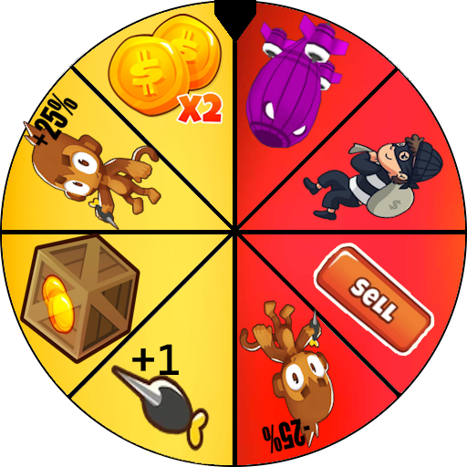

<h1 align="center">The Wheel Of Doom</h1>

### Introducing a new wheel feature in the game, positioned in the bottom left corner. This mod wouldn't be possible without DarkTerraYT's help

    

Completed:

* Base Wheel with 8 buff/debuff

Yet to Come:

* A new wheel.
* revamped user interface with slot for new wheels!
  
<h1 aling="left"></h1>

